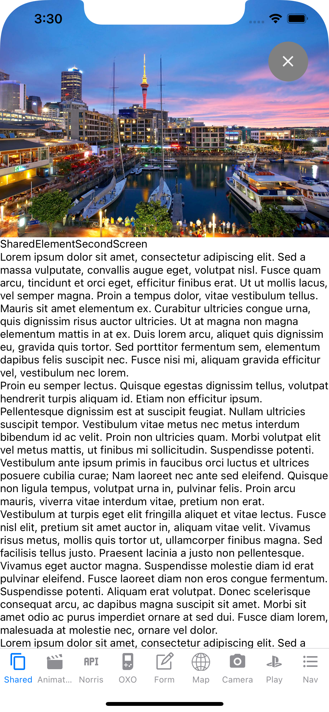

# rndemo

Demo application presented for realestate.co.nz on 29th Jan 2021

Placeholder instructions for those interested in playing with this demo app. I'll add to these based on feedback.

   1. Install the dependency tools described in the React Native environment setup guide (click React Native CLI Quickstart): https://reactnative.dev/docs/environment-setup 
   2. Clone the repo into a local directory on your Mac
   3. cd rndemo
   4. npm install
   5. cd ios
   6. pod install
   7. cd ..
   8. npm run ios
 
 There will be one or two extra steps, e.g. getting your own Google Maps API key, however that should get you started.
 
